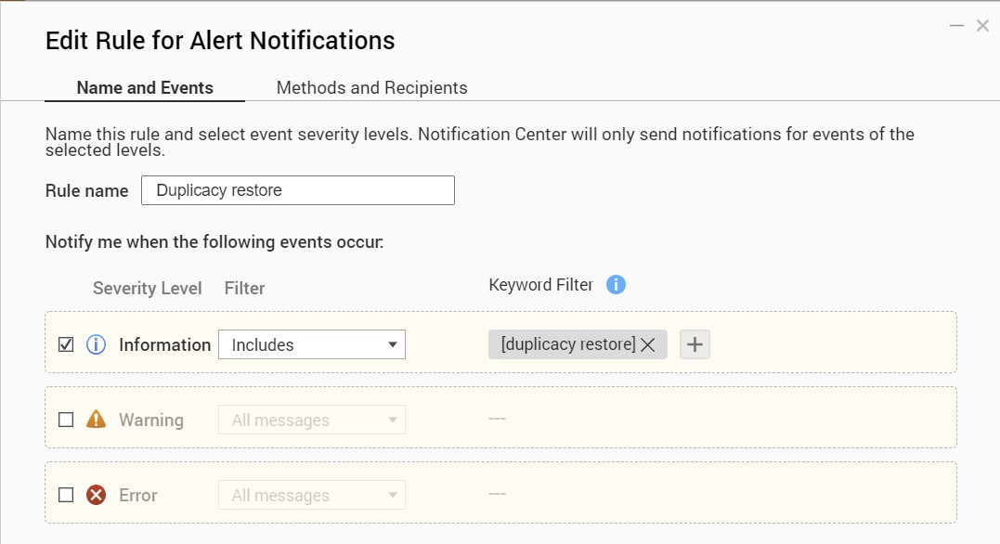

# DuplicacyLog -- QPKG to log messages to QNAP Notification Center and healthchecks.io

DuplicacyLog captures the output and exit status of duplicacy `backup`, 
`copy`, `prune`, `check`, and `restore` commands, logs a summary message 
to the QNAP Notification Center, and optionally posts to 
[healthchecks.io](https://healthchecks.io/). 

**NOTE**: Logged messages currently do not include the *Users*, 
*Application*, or *Category* fields due to a QNAP `log_tool` bug. 

## Installation

Prerequisite: [Duplicacy Web UI](https://duplicacy.com/buy.html),
[QNAP packages for testing](https://forum.duplicacy.com/t/qnap-packages-for-testing/4114)

Download QPKG for appropriate CPU type from the `build` directory and install manually using the
[QNAP App Center](https://www.qnap.com/en/how-to/knowledge-base/article/how-to-install-qnap-applications-qpkg-files-manually/).

## Use

Starting `DuplicacyLog` replaces the duplicacy CLI used by the Duplicacy 
Web UI with the `duplicacy-wrapper.py` script and links 
`/usr/bin/duplicacy` to the real CLI. Stopping `DuplicacyLog` restores 
the real CLI and `/usr/bin/duplicacy` remains linked to the real CLI. 

Commands are the same as the duplicacy CLI, plus the following options 
may be set in the `-comment` global option: 
	
Option				| Description
:---				| :---
`log_at_start`		| Log an Information message when starting duplicacy	
`log_verbose`		| Log individual WARN, ERROR, FATAL, and ASSERT messages
`healthchecks=`*url*| Send pings to healthchecks.io

**NOTE**: Use of whitespace in the `-comment` option currently causes an 
error due to a Web UI bug. 

## Example Notification Center filters

Send notifications on successful `check` and all warnings and errors:

Send notifications when `log_at_start` specified:

Send notifications on successful `restore`:

**NOTE**: Filtering on more than one keyword currently does not work due to a QNAP
Notification Center bug.

## Use in other environments

Modify `shared/duplicacy-wrapper.py` to adapt DuplicacyLog to other 
environments, for example, modify the `log_tool()` function to send 
email instead of running the QNAP `log_tool` command. 

See `shared/DuplicacyLog.sh` for example `bash` commands that replace 
the Duplicacy CLI executable run by Duplicay Web with the wrapper 
script. 

(The wrapper is not a `bash` script because `bash` ignores the `INT` signal,
which Duplicacy Web sends to abort the CLI.)
